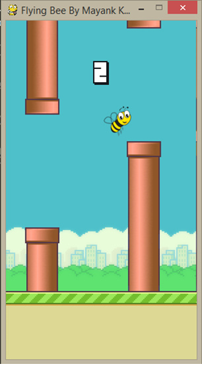

# Flying Bee Project
Flying Bee is an arcade game and this game explores the use of physical law (gravitational law) for the game development. The game in its exactness follows rules similar to that of the original game known as Flappy Bird.

The rules and regulations of the game are very basic and easy to understand.The game scenario puts the player in control of a hovering Bee in the screen with the moving obstacles of pipelines.

The goal of the game is to get through the opening in the obstacles without colliding into them. The game is implemented in Python. The case study discusses the use of simpler motion and modification to build the abstraction.

In addition, this report will also discuss the strategies used to stimulate the pipeline pattern in the leisure environment. The game is in single player mode.

The user can interact with the game using mouse or keyboard. The position of the obstacles will also be discussed. The game is a 2D game with the purpose to keep the Bee moving forward.

Flying Bee was a project that was given to me as a College Assignment werein my teamates were Mayank, Manvi And Kazim.

## Project Formats
This game is available as Python (.py) Format as well as an Executable (.exe) File.

The link to download the setup for .exe file is :
https://mercuryhg007.itch.io/flying-bee-game

## Screenshots

